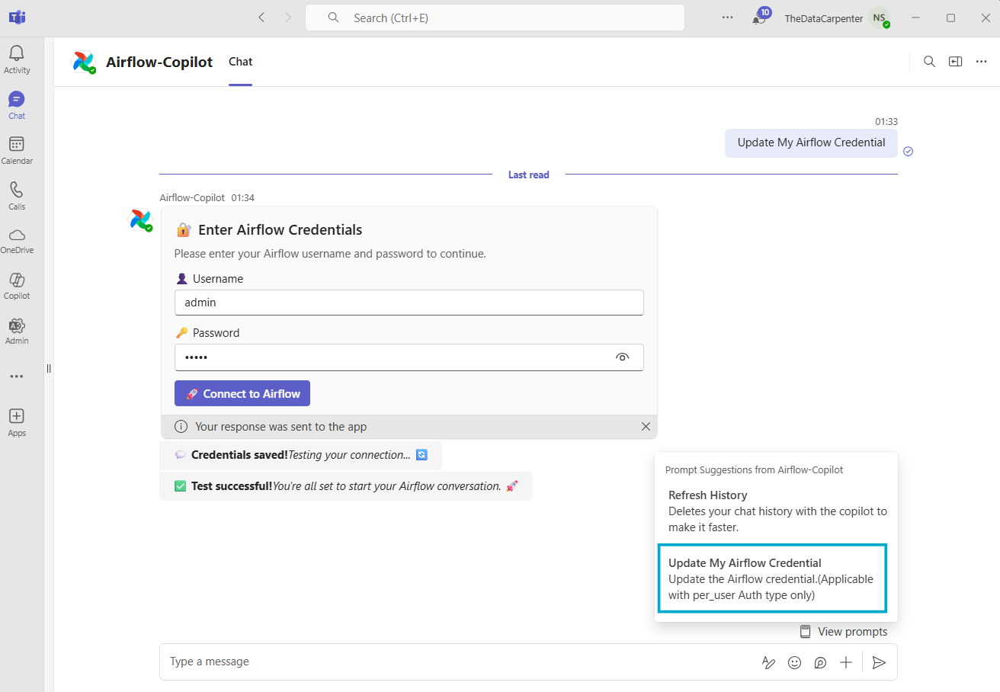

# 🔐 Airflow Auth Type

Airflow Copilot supports two authentication strategies to interact securely with Apache Airflow:

- **centralized**
- **per_user**

By default, **per_user** authentication is enabled, which restricts unauthorized access and provides user-specific credential validation.

---

## 🛠️ Centralized Authentication

In **centralized** mode, a common set of Airflow credentials is used for all users. These credentials are passed during deployment and remain fixed unless the service is redeployed.

 ✅ Recommended for: small teams with shared access rights  
 ⚠️ Avoid this setup if users require role-based or restricted access.

### 🔧 Configuration

Set the following environment variables during deployment:

```env
AIRFLOW_AUTH_STRATEGY=centralized
AIRFLOW_USER_NAME=<airflow username>
AIRFLOW_USER_PASSWORD=<airflow password>
```

### Design

- All users share the same access level.
- If credentials change, you must update the deployment or restart the container.

---


---


## 👤 Per-User Authentication

With `per_user` auth type, each user can securely store their Airflow credentials using the Microsoft Teams interface.

- Credentials are stored in **PostgreSQL** with **Fernet encryption** — same as Airflow’s default encryption method.
- Ensures users only access resources they are authorized for.

✅ **Recommended for**: enterprises, teams with multiple roles, or fine-grained access control.

---

### 🔧 Configuration

```env
AIRFLOW_AUTH_STRATEGY=per_user
AIRFLOW_USER_NAME=
AIRFLOW_USER_PASSWORD=
```


📝 **Note**: Leave `AIRFLOW_USER_NAME` and `AIRFLOW_USER_PASSWORD` blank — credentials are set by each user individually through the Microsoft Teams UI.

### Design

--
- All users share their own credential.
- If credential change for any user, he/she can change it directly using MS Team Prompt.


---


### 🧭 How Users Can Set Their Airflow Credentials

Open **Microsoft Teams** and find the **Airflow Copilot** bot.

Type the following command (case insensitive):

`Update my Airflow Credential`


The bot will display a secure input form asking for:

- **Username**
- **Password**

Upon submission, the bot:

- 🔐 Encrypts and stores the credentials
- ✅ Validates them by calling `GET /dags` on your Airflow instance

---

### 🖼️ Visual Aid

*A screenshot here helps users visualize the workflow and credential setup process.*





## 🔗 Next Steps

- **[Message Summarization](//architecture/summarization)**: Understand the Agent workflow.
- **[Supported Airflow Copilot Features](/architecture/supported_apis)**: List of activity Airflow copilot can do.
- **[Environment Variables](configuration/environment_variables)**: Configration details of Airflow Copilot.
- **[Refresh History](/architecture/refresh_history)**: How to delete/purge user conversation with Airflow copilot from backend database(postgres)
- **[Supported Airflow Copilot Features](/architecture/supported_apis)**: List of activity Airflow copilot can do.


