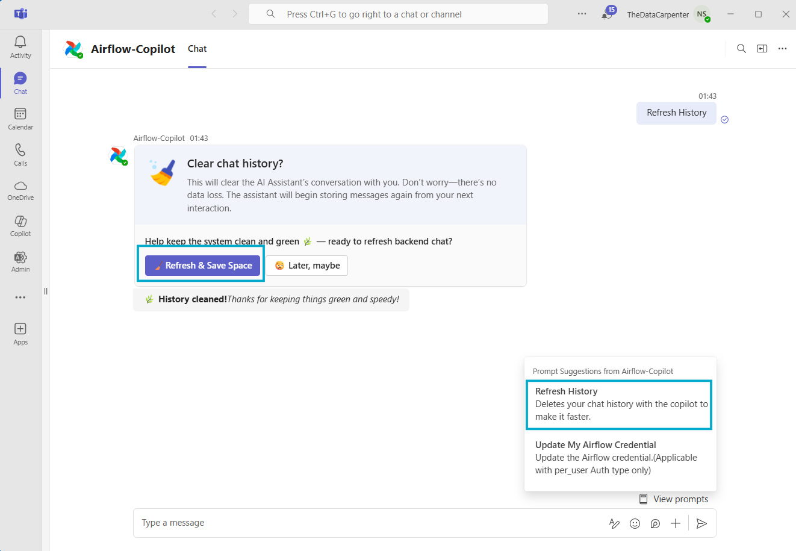

# 🗑️ Refresh History

**Airflow Copilot** stores **every chat message** in a PostgreSQL check‑pointer so the agent can
resume conversations.  
Although messages are summarised for the LLM, **they still accumulate in the database** and
can eventually consume storage.

The **“Refresh History”** prompt lets a user wipe their own conversation records, keeping
the backend lean without touching shared data or credentials.

---

## 🔍 Why Refresh History?

| Reason | Benefit |
|--------|---------|
| 🧹 **Reduce database bloat** | Frees disk space and keeps query performance high. |
| 🔒 **Privacy / Compliance** | Users can remove sensitive chat content on demand. |
| 💡 **Clean slate** | Start a new conversation thread without prior history. |
| 💡 **New Start** | Conversation start accumulating again when user interect with Bot. |

---

## ⚙️ What Gets Deleted?

| Item | Deleted? |
|------|----------|
| Conversation messages (`user messages` & `ai message`) | **Yes** |
| Per‑user Airflow credentials (`credentials` table, **per_user** auth) | **No** |
| Global settings, logs, audit records | **No** |

> ⚠️ Only the user’s own chat records are removed. Other users’ data is untouched.

---

## 🛠️ How to Refresh History?

1. Open **Microsoft Teams** and chat with **Airflow Copilot**.  
2. Type the command (case‑insensitive): ```Refresh History```
3. The bot will prompt for confirmation:  **“Clear Chat History?”**
4. Click **Refresh & Save Space**.  
5. Copilot replies  **“🌿 History cleaned!Thanks for keeping things green and speedy!”**



---

##🔐 Security Notes
* **Credentials are preserved** – users do not need to re‑enter Airflow username / password after a history wipe.
* Only the requesting user can delete their own history.

##✅ Best Practice
* Run the cleanup **Every day** when the conversation end. (e.g., after certain task).
* Administrators can automate bulk purges with SQL if required. Truncate all tables except `user_credentials` table.
* For long‑lived conversations, rely on **Summarization** to keep the LLM context short, and
use **Refresh History** to manage storage footprint.


## 🔗 Next Steps

- **[Supported Airflow Copilot Features](/architecture/supported_apis)**: List of activity Airflow copilot can do.
- **[Airflow Auth Type](/architecture/airflow_auth_type)**: Airflow Auth type supported to authentication.
- **[Environment Variables](/configuration/environment_variables)**: Configration details of Airflow Copilot.

