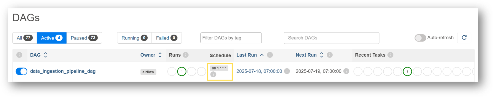
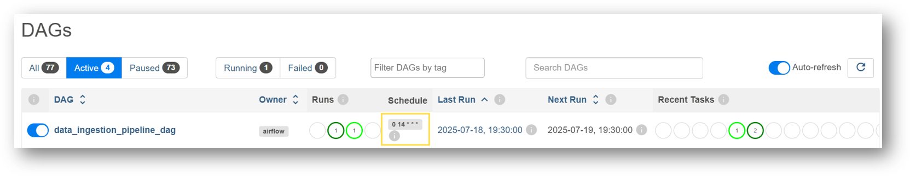
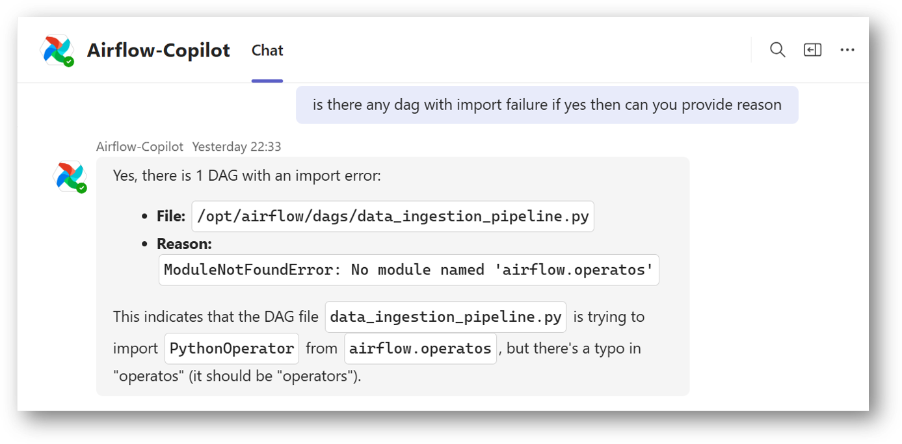
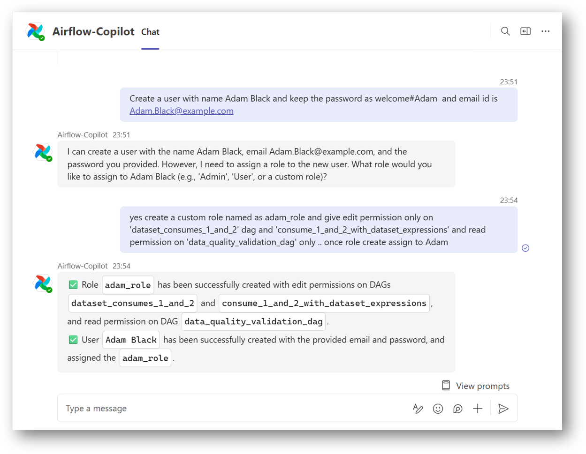
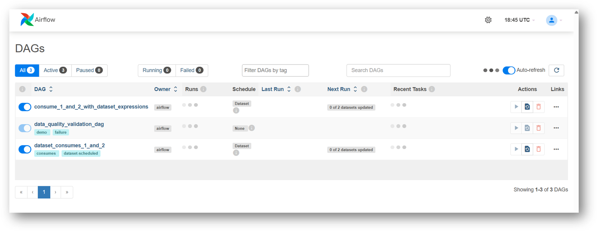
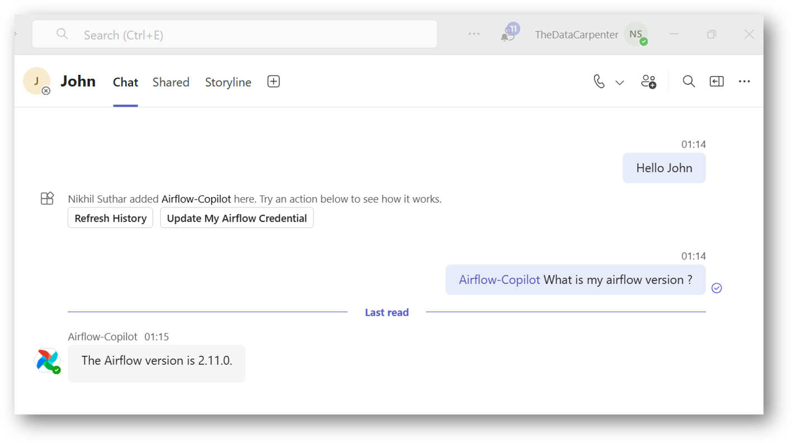

# Airflow Copilot in Action: Common Chat Examples

This document showcases some practical examples of how you can interact with **Airflow Copilot** using natural language. From basic queries to advanced DAG operations, the assistant simplifies your Airflow operations through Microsoft Teams.

> 💬 All conversations shown here are examples — you can talk to Copilot naturally, and it will try to interpret your intent intelligently.

---

## 1. 🔧 Basic Configuration & Setup

You can start the conversation with a simple greeting like `Hello`. If everything is configured correctly, the assistant will greet you back using your name. If not, this may indicate a setup issue.

If your environment uses **per-user authentication**, you’ll be prompted to update your Airflow credentials. This is only required **once** (or again if your password changes). Use a command like:


---

## 2. 📊 Basic DAG Interaction

You can ask Copilot to **retrieve information** or **take actions** on your DAGs. It also supports **fuzzy matching**, so even if the DAG name isn’t exact, it will try to infer the closest match.

Example flow: `Give me list of dags`. After reviewing the list, you can act on a specific DAG: `enable the dag conditional_dataset_and_time_based_timetable`

<div class="scroll-container">

</div>

> ⚠️ Frequent listing of DAGs consumes your LLM quota. Prefer calling DAGs by name directly once you're familiar.

---

## 3. ⏱️ Update DAG Schedule or Tags

Airflow’s REST API doesn’t allow modifying DAG schedules, tags, or owners if defined in code. But here’s a workaround:

You can **store the schedule as a Variable** and ask Copilot to update that variable. For example:

Ensure your DAG code reads the schedule from the variable. This pattern enables dynamic scheduling via chat.

### How to define the dynamic Schedule?
You simply need to create an Airflow variable first and pass the value (Cron or Airflow-supported Schedule), then use the same in code. Below is a sample code snippet.

<details>
<summary><code>dynamic_schedule_dag.py</code></summary>

```yaml title="dynamic_schedule_dag.py"
  --8<-- "./docs/assets/example/dynamic_schedule_dag.py"
```
</details>


Initially, the schedule is `30 1 * * *`



Let's ask Copilot to change the schedule:


Let's validate the same on the Airflow UI

> Note: Airflow may take some time to reflect the schedule change. This depends on your scheduler's DAG refresh interval.



---

## 4. 🐞 Get Task Failure Logs & Resolution

Want to debug a failed task?

If you don't have the run ID handy, ask:

After receiving logs, you can also request resolution suggestions:

<div class="scroll-container">

</div>

> Copilot can **analyze logs**, but **won’t modify code**.

---

## 5. 📄 View DAG Source Code

Need to verify the DAG's implementation?

Just ask:

```
provide me source code of the DAG <your dag id>
```

You’ll receive the currently deployed code. **However, editing this code via chat is not yet supported — that’s planned for future updates.**

<div class="scroll-container">

</div>

---

## 6. 🧱 View the Import Failure DAG

If you have uploaded a DAG and it failed during compilation, you can confirm that using Airflow Copilot.  
Simply ask the Copilot to provide any **import failure DAGs**, and it will return the details, including the **error logs** and possible reasons for failure.



---

## 7. 👤 Create User with Custom Roles

Creating users with fine-grained DAG permissions is usually complex. Copilot simplifies this:

You can also assign roles or generate passwords. If no password is provided, Copilot will attempt to create one — but due to security, the password returned may or may not always be shown.

> Always try to **specify the password** explicitly.



Let's validate on the Airflow UI: It has done the job...



---

## 8. 💬 Chat Anywhere

Airflow Copilot is designed so that you can ask it from any Teams or chat conversation. You just have to mentioned it as **`@Airflow-Copilot`** in chat start.

For example, In below we have mentioned Airflow Copilot directly in a conversation with **John** instead of opening a separate **Airflow-Copilot** chat.



---

## 9. 🧰 Other Supported Operations

Airflow Copilot can help you with many other actions, including:

- Checking connections
- Managing pools
- Viewing XCom values
- Triggering backfills
- And more...

Refer to the [**Capabilities Section**](../architecture/supported_apis) for the full list.

---

> 🌀 **Tip:** Regularly use **Refresh History** to clear long conversation chains and keep your session lightweight and responsive.
