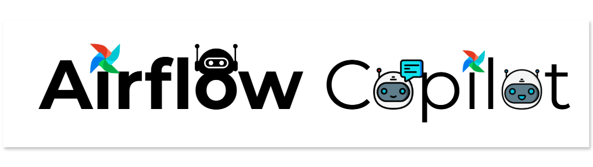

# Welcome to **Airflow Copilot**

A conversational agent that lets you run, monitor, and manage Apache Airflow directly from Microsoft Teams—powered by LLMs and the Airflow REST API.

---

## 🔗 Where do you want to go?

| Section | Jump‑in link | Why visit? |
|---------|--------------|------------|
| 🚀 **Quick Start** | [Get up & running](quickstart/getting_started.md) | Two‑file Docker setup for local tests |
| 🛠️ **Architecture** | [How it works](architecture/architecture.md) | High‑level design & component flow |
| ⚙️ **Configuration** | [Environment variables](configuration/environment_variables.md) | All runtime settings in one place |
| 📦 **Deployment** | [Docker / AWS / K8s](deployment/docker-deployment.md) | Move from local to production |
| 🤖 **Agent Behaviour** | [Behaviour notes](quickstart/agent-behavior.md) | Retries, fall‑backs, limitations |
| ❓ **FAQ** | [Frequently asked questions](faq.md) | Quick answers to common hurdles |
| ❤️ **Contributing** | [How to contribute](contributing.md) | Open source guidelines & roadmap |

---

## ✨ Key Features

- **Chat‑driven orchestration:** trigger DAGs, inspect runs, manage tasks—all from Teams.
- **LLM‑powered reasoning:** supports OpenAI, Google GenAI, Anthropic, Groq models.
- **Role‑aware actions:** honours Airflow RBAC when executing API calls.
- **Pluggable memory:** conversation state stored in PostgreSQL via LangGraph checkpoints.
- **Local‑to‑cloud parity:** same Docker images work on Docker Compose, Kubernetes, or ECS.

---

> 💡 **Tip:** Clone the repo, follow the Quick Start, and you’ll have a working Copilot in < 10 minutes.

Enjoy exploring **Airflow Copilot**—and automate responsibly!
