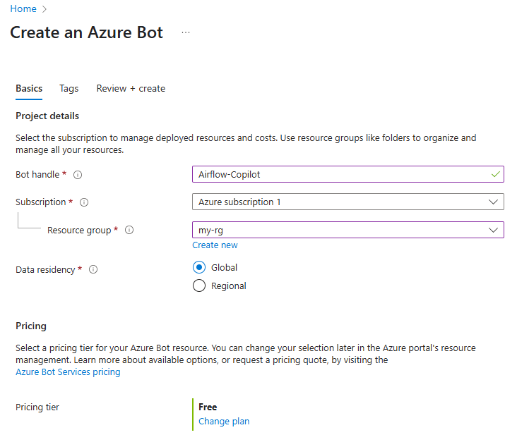
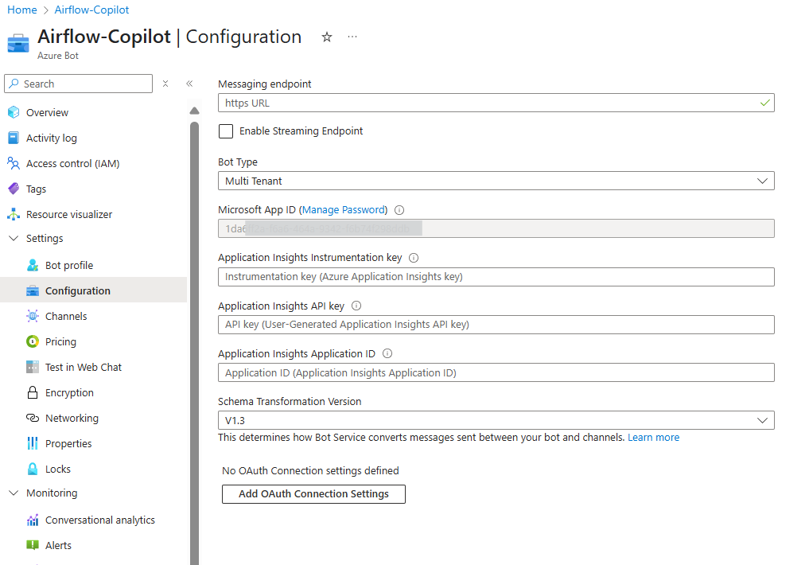
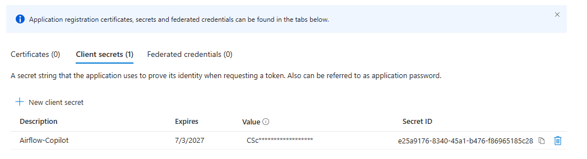
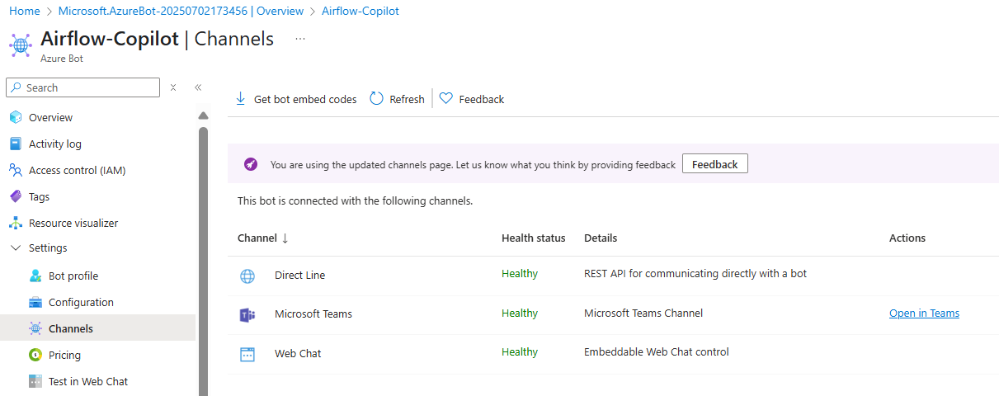
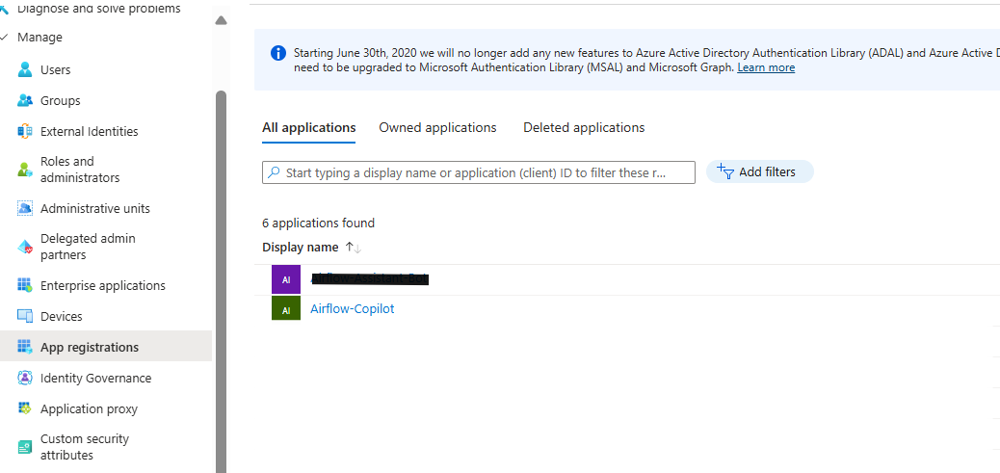
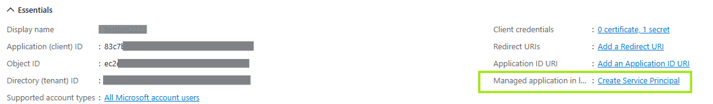

# 👾 Create an **Azure Bot** (for Microsoft Teams)

Airflow Copilot communicates through a **custom Microsoft Teams bot     ** hosted on **Azure Bot Service**. Follow these steps to register the bot, enable Teams, and wire the credentials into Copilot.

---

## 🧭 Process at a Glance

| Step | Action | Outcome |
|------|--------|---------|
| 1️⃣  | **Register Bot** in Azure Portal | Generates *Microsoft App ID* & *Client Secret* |
| 2️⃣  | **Enable Teams Channel** | Allows Teams users to message the bot |
| 3️⃣  | **Set Messaging Endpoint** | Points Azure Bot → `https://…/api/messages` |
| 4️⃣  | **Add Credentials to Copilot** | Copilot verifies every incoming request |

---

## 🛠️ Step‑by‑Step Guide

### 1. Register the Bot

1. Sign in to the **[Azure Portal](https://portal.azure.com/#home)** (a free‑tier account works fine).  
2. Click **➕ Create a resource** → search **“Azure Bot”** → **Create**.  
3. Fill in the form and Click **Review + Create** → **Create**.


   | Field | Example / Notes |
   |-------|-----------------|
   | **Bot handle** | `Airflow‑Copilot` |
   | **Subscription** | Your active subscription |
   | **Resource group** | Create or reuse one |
   | **Data residency** | *Global* (or preferred region) |
   | **Pricing tier** | `F0   Free` (dev) or `S1` (prod) |
   | **Messaging endpoint** | *Leave blank for now* |


   


---

### 2. Grab App Credentials

1. Open the newly‑created **Bot Resource**.  
2. Go to **Settings → Configuration**.  
3. Copy the values below *(store them securely!)*:

```env
MICROSOFT_APP_ID= 1da6ff2a-xxx-xxxx-xxxx-xxxxxxxxxxxx
MICROSOFT_APP_PASSWORD= Csc**************************
```


   

> **Note:** the client secret is shown **only once** after creation. Keep it safe.

   

---

### 3. Enable the Teams Channel

1. In the left panel, choose **Channels**.  
2. Click **Microsoft Teams** → **Save**.  

Your bot is now reachable from Microsoft Teams 🎉

   

---

### 4. Configure the Messaging Endpoint

| Environment | What to do | Notes |
|-------------|------------|-------|
| **Development / Local** | Nothing – the Docker Compose stack auto‑patches the endpoint with the current **ngrok** URL. | |
| **Production** | Paste your stable HTTPS URL (e.g. `https://<copilot.your‑domain.com>/api/messages`) into **Settings → Configuration → Messaging endpoint** and click **Save**. | Do this once after deployment or DNS cut‑over. |


---

## 🔐 Optional: Required Only for Local Deployment

When deploying Airflow Copilot locally, the bot’s **Messaging Endpoint (NGROK URL)** get update during deployment script. This update requires authentication to Azure using a **Service Principal (SPN)**.

If you already have a separate service principal with **Contributor** access to the Azure Bot resource group, you can skip this step and use same in *AZURE_CLIENT_ID* and *AZURE_CLIENT_SECRET* in `docker-compose.yml` file. Otherwise, follow the instructions below to create one for the existing Azure Bot.

---

### 🧭 Steps to Create a Service Principal

1. Navigate to **Microsoft Entra ID** in the Azure portal.
2. In the left panel, select **App registrations**, then switch to the **All applications** tab.

      

3. Select your Azure Bot app from the list, then click on **Create service principal**.

      

4. After creating the SPN, go to **Subscriptions** and open the subscription associated with your Azure Bot.
5. Click on **Access control (IAM)** → **➕ Add** → **Add role assignment**.
6. Choose **Contributor** from the list of roles under **Privileged administrator roles**.
7. In the **Members** step, choose **User, group, or service principal**, then click **➕ Select members**.
8. Search for and select your Bot’s app registration name.
9. Click **Review + assign** to complete the setup.

---

Once completed, you can use `MICROSOFT_APP_ID` as  `AZURE_CLIENT_ID` and `MICROSOFT_APP_PASSWORD` as  `AZURE_CLIENT_SECRET`, and `AZURE_TENANT_ID` in your deployment environment.


## ✅ Recap

| Azure output | Copilot variable | Purpose |
|--------------|-----------------|---------|
| **App ID** | `MICROSOFT_APP_ID` | Bot identity verification |
| **Client Secret** | `MICROSOFT_APP_PASSWORD` | JWT signing for incoming messages |
| **Teams channel** ✔️ | — | Enables chat from Teams to Copilot |

---

## 🔐 Security Best Practices

* **Never** hard‑code secrets – inject them via environment variables, Docker Secrets, or a secrets manager.  
* Rotate the **Client Secret** regularly (e.g. every 90 days).  
* Apply least‑privilege RBAC to the bot’s resource group.

---

## 🔗 Next Steps

- **[Upload Airflow Copilot App to Microsoft Teams](quickstart/prerequisites.md#upload-to-teams)**  : Sideload or publish Copilot in your organisation.
- **[Agent Behavior Notes & Known Limitations](quickstart/agent-behavior)**: Some know Airflow Copilot behaviour and Limitations.
