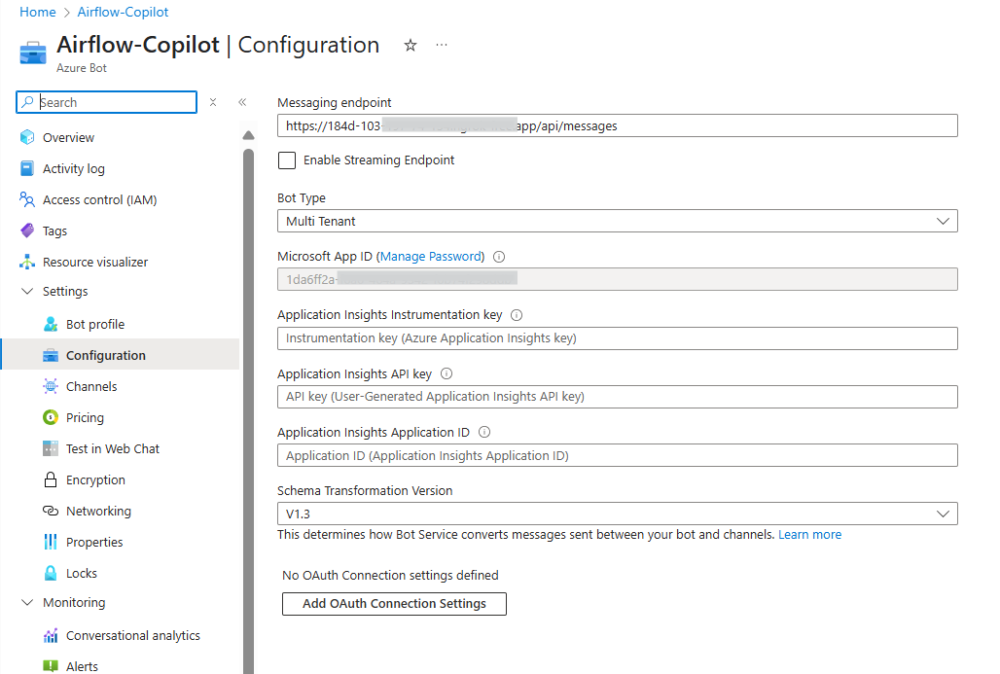

# 🚀 Getting Started — Airflow Copilot  

This guide walks you through launching  **Airflow Copilot** using Docker Compose files.

---

>**Note:** This Quick Start guide covers local deployment only. For production or cloud-based deployments, refer to the [**Deployment**](../../deployment/deployment/) section.


## 🧰 Prerequisites

Make sure you have the following ready:

- **Docker** – Install from [**Docker Docs**](https://docs.docker.com/engine/install/)
- **Apache Airflow** – Version > `2.5.0` 
  Use the [**official Docker Compose setup**](https://airflow.apache.org/docs/apache-airflow/2.11.0/howto/docker-compose/index.html)
- **PostgreSQL** – Shared between Airflow and Copilot
- **Ngrok Authtoken** – For public URL tunneling (local bot testing)
- **Azure Bot Credentials** – follow [Create an Azure Bot](/quickstart/azure_bot/) to obtain  
    - Microsoft App ID & Password  
    - Azure Service Principal (Client ID & Secret)  - Usually same as above.
    - Azure Resource Group  
    - Azure Tenant ID
    - Azure Bot Name
- **Fernet Key** (32‑byte secret): create using below script (if not)

  ```bash
  python -c "from cryptography.fernet import Fernet; print(Fernet.generate_key().decode())"
  ```

- **LLM Provider & API Keys**  
    Supported: `OpenAI`, `Google_GenAI`,  `Anthropic`, `Groq`

   > To get started free go with Google Gemini, [**create a free API key**](https://ai.google.dev/) and use the `gemini-2.5-flash` model.


---


## 🧪 Design(conceptual)
Below design reflect the local deployment of the **Airflow Copilot**.


## 🛠 Step 1 — Launch Apache Airflow

If Airflow isn’t running:

1. Follow the guide: [**Run Airflow via Docker Compose**](https://airflow.apache.org/docs/apache-airflow/2.11.0/howto/docker-compose/index.html)
2. Ensure Airflow and PostgreSQL are up.

➡️ Airflow UI → <http://localhost:8080>  
🔐 Login → `admin` / `admin`

---

## 🤖 Step 2 — Deploy Airflow Copilot

1. Create a **`.env`** file using the template below and update all the necessary environment variables required for deployment.  

    For detailed descriptions of each variable, refer to the [**Environment Variables**](../configuration/environment_variables.md) section.


    <details>
    <summary><code>.env</code></summary>
    ```env
    --8<-- "./.env.example"
    ```
    </details>

2. Create **`docker-compose.local.yml`** in same **`.env`** folder.  

    <details>
    <summary><code>docker-compose.local.yml</code></summary>
    ```yaml title="docker-compose.local.yml"
    --8<-- "./docker-compose.local.yml"
    ```
    </details>
---

## ▶️ Run Copilot

```bash
# Create Docker network (once)
docker network create airflow

# Start all services
docker compose -f docker-compose.local.yml up -d
```

---

## 🧽 Clean Up

```bash
docker compose -f docker-compose.local.yml down -v
```

---

### What Happens Next 🎉

- Copilot launches on **`http://localhost:3978`**  
- Ngrok exposes a public URL and the Azure bot endpoint is patched automatically. Confirm it by login to Azure and check the endpoint corresponding to Airflow-Copilot Bot created.

   


- Chat with **Airflow Copilot** directly in Microsoft Teams! Login to Azure Portal and validate the same. Update the Airflow Credential if the deployment is with `per_user`**AIRFLOW_AUTH_STRATEGY**

## 🔗 Next Steps

- **[How to Update the Airflow Credential?](../../architecture/airflow_auth_type)** 
- **[Agent Behavior Notes & Known Limitations](../agent-behavior)**: Some know Airflow Copilot behaviour and Limitations.


