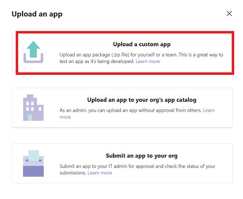

# 📤 Deploying Airflow Copilot App to Microsoft Teams

After creating your Azure Bot, follow the steps below to connect it to the Airflow Copilot Teams app and upload the package.

---

## 1: App‑Level Deployment Options

| Deployment | Who can do it | Visibility |
|------------|---------------|------------|
| **Organization‑wide** | Teams tenant admins | Available to all users |
| **Personal scope** | Any user | Visible only to the uploader |

---

## 2: Link the Azure Bot to the Teams Manifest

1. Locate the **Microsoft App ID** from the Azure Bot you created earlier.  
   *(See [Create Azure Bot](../quickstart/azure_bot.md) if you need a refresher.)*

2. [**Download**](https://github.com/NikhilSuthar/airflow-copilot/blob/main/manifest/manifest.zip) the Copilot Teams manifest ZIP.

3. **Extract** the ZIP and open `manifest.json`.

4. Replace every instance of **`${MICROSOFT_APP_ID}`** with your real App ID  
   *(usually appears twice).*

5. **Re‑zip** exactly these three files — **not the folder**:

   ```
   manifest.json
   color.png
   outline.png
   ```

---

## 3: Upload the App to Microsoft Teams

> **Note:** Uploading custom apps may be disabled on tightly‑managed tenants. Check with your Teams admin if the options below are missing.

> The custom app option is also not available with community version of Microsoft Teams.

1. Open **Microsoft Teams**.

2. Click **Apps** in the left sidebar.

3. Select **Manage your apps** at the bottom.

4. Click **➕ Upload an app**. Depending on your permissions you will see:

    - **Upload an app to your org's app catalog** – Admin only  
    - **Upload a custom app** – Personal scope  
    - **Submit an app to your org** – Require Admin approval.

    

5. Choose the re‑zipped package and confirm.

Once uploaded, Airflow Copilot will appear in your Apps list. Invite it to a channel or chat privately to start issuing Airflow commands.

---

### ✅ Next Steps

- [Run the **Airflow Copilot**](../quickstart/getting_started.md)
- Pin Copilot to the left rail for quick access
- Review [**Agent Behavior Notes**](../quickstart/agent-behavior.md) for best practices
